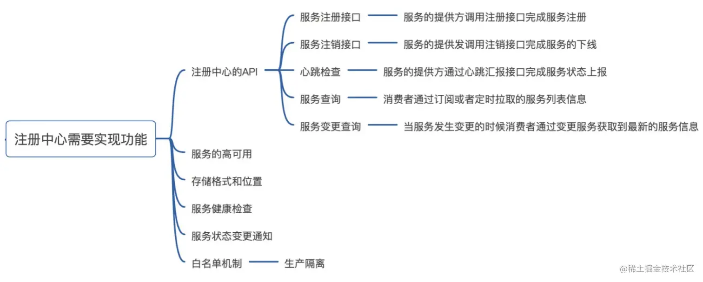
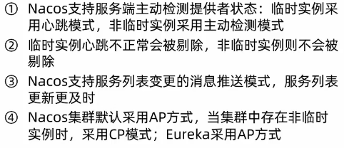
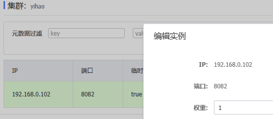
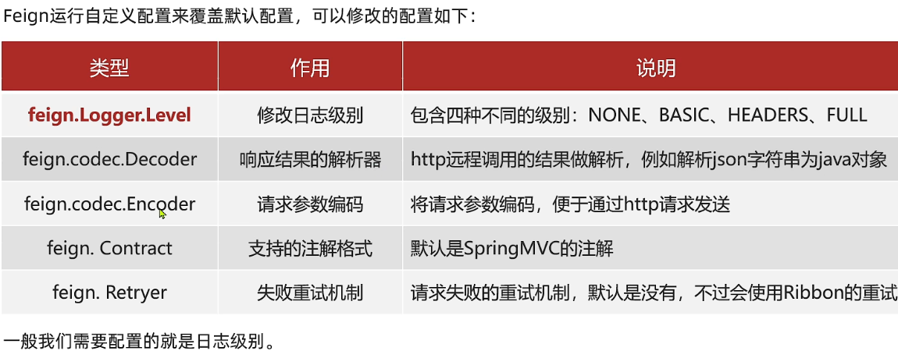
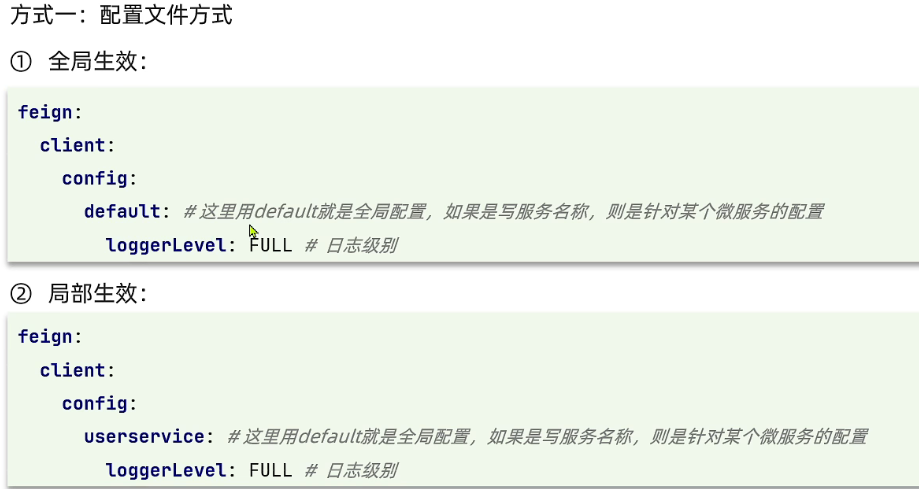
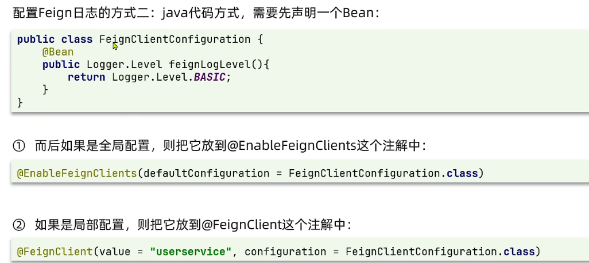
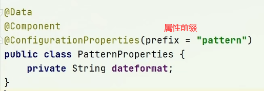
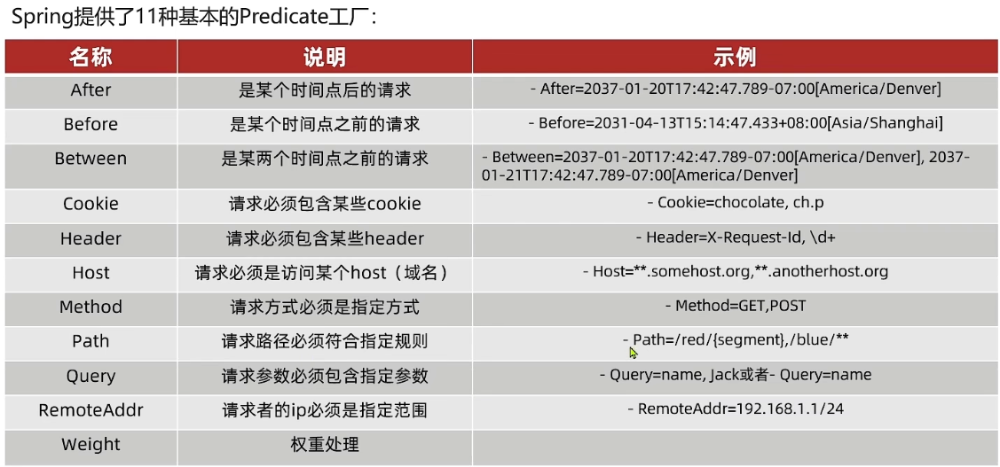
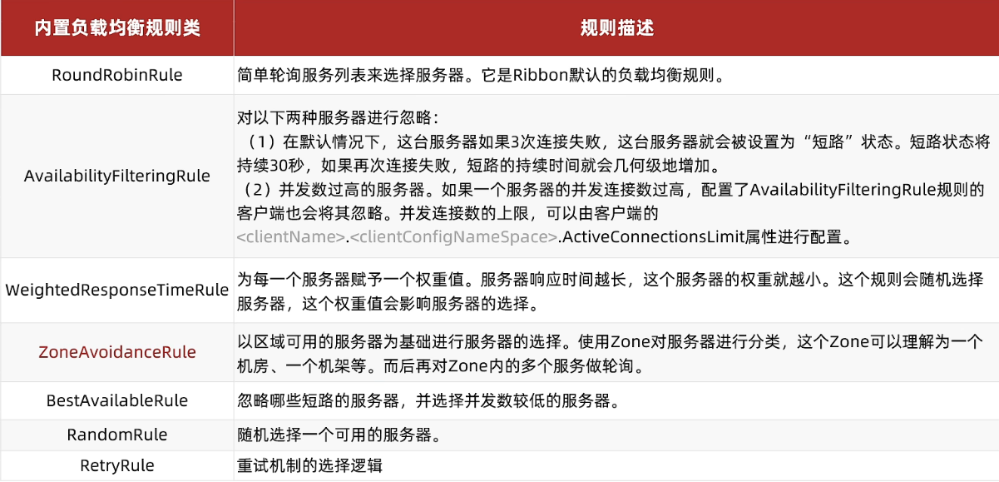

# 信息


## 简介

> "Spring Cloud为开发人员提供了快速构建[分布式](#分布式)系统中一些常见模式的工具（例如配置管理，服务发现，断路器，智能路由，微代理，控制总线）。分布式系统的协调导致了样板模式, 使用Spring Cloud开发人员可以快速地支持实现这些模式的服务和应用程序。他们将在任何分布式环境中运行良好，包括开发人员自己的笔记本电脑，裸机数据中心，以及Cloud Foundry等托管平台。" -----来自官网


**SpringCloud集成各种功能组件，SpringBoot实现组件的自动装配**


## SpringCloud五大组件

1. [注册中心](#注册中心)
1. [负载均衡/服务调用](#负载均衡/服务调用)
1. [配置中心](#配置中心 )
1. [网关](#网关)
1. [熔断器](#)


# 注册中心


## 什么是服务注册中心


### 服务注册中心一般有三种角色

 - 服务提供者(xx Server) : **启动时，用于向registry注册自身服务**，并定期发送心跳存活状态。
 - 服务消费者(xx Clientt)：**启动时，向registry订阅服务**，把registry返回的服务节点列表缓存到本地内存中，并与 Server建立连接。
 - 服务注册中心（registry）：**用于保存服务提供者提供的注册信息**，当 Server 节点发生变更时，Registry 会同步变更，RPC Client 感知后会刷新本地 内存中缓存的服务节点列表。

​	最后，Client 从本地缓存的服务节点列表中，基于负载均衡算法选择一台  Sever 发起调用。


​	服务注册中心是微服务架构中的纽带，类似于`通讯录`，它记录了**`服务`**和**`服务地址`**的映射关系。在分布式架构中，服务会注册到这里，当服务需要调用其它服务时，就到这里根据服务名找到服务的地址，进行调用,从而若若若解决**`服务发现`**的问题。


### 注册中心需要实现的功能




## 多种注册中心技术 

- [Eureka](Eureka)

- Nacos 
- Zookeeper
- 等


### Eureka和Nacos区别

Eureka和Nacos都是服务发现和注册的工具，但是有以下区别： Eureka是Netflix开源的工具，而Nacos是阿里巴巴开源的工具。 Eureka只提供了服务发现和注册功能，而Nacos除了服务发现和注册之外，还提供了配置管理和消息总线等功能。 Eureka采用的是心跳检测机制，而Nacos采用了健康检查机制。




## Eureka


#### Eureka的作用

##### 消费者该如何获取服务提供者具体信息?
- 服务提供者启动时向eureka注册自己的信息

- eureka保存这些信息

- 消费者根据服务名称向eureka拉取提供者信息

##### 如果有多个服务提供者，消费者该如何选择?

- 服务消费者利用**负载均衡**算法，从服务列表中挑选一个

##### 消费者如何感知服务提供者健康状态?
- 服务提供者会每隔30秒向EurekaServer发送心跳请求，报告健康

- 状态eureka会更新记录服务列表信息，心跳不正常会被剔除
- 消费者就可以拉取到最新的信息


#### Eureka配置

1.导入eureka服务包

```xml
<dependency>
    <groupId>org.springframework.cloud</groupId>
    <artifactId>spring-cloud-starter-netflix-eureka-server</artifactId>
</dependency>
```

2.注册为springcloud注册中心

```java
@EnableEurekaServer//eurek自动装配
@SpringBootApplication//spring配置类
public class EurekaApplication {
    public static void main(String[] args) {
        SpringApplication.run(EurekaApplication.class, args);
    }
```

3.配置信息(注册自己)

```yml
server:
  port: 10086 # 服务端口
spring:
  application:
    name: eurekaserver # eureka的服务名称
eureka:
  client:
    service-url:  # eureka的地址信息
      defaultZone: http://localhost:10086/eureka
```

```cmd
sudo tee /etc/docker/daemon.json <<-'EOF' 
{
  "registry-mirrors": [
  		"https://cr.console.aliyun.com",
        "https://hub-mirror.c.163.com",
        "https://mirror.baidubce.com",
        "https://ccr.ccs.tencentyun.com",
		"https://dockerproxy.com"
]
}
EOF
```


#### 服务注册

1.引入依赖

```xml
<dependency>
    <groupId>org.springframework.cloud</groupId>
    <artifactId>spring-cloud-starter-netflix-eureka-server</artifactId>
</dependency>
```

2.加配置

```yml
eureka:
  client:
    service-url:  # eureka的地址信息
      defaultZone: http://localhost:8080/eureka
```

#### 服务发现

1.在注入RestTemplate Bean的时候加上注解@LoadBalanced

```java
/**
 *  在配置类中注入RestTemplate对象(bean)到Spring容器
 */
@Bean
@LoadBalanced
public RestTemplate restTemplate(){
    return  new RestTemplate();
}
```

2.把请求路径的ip，端口换为服务名

```java
restTemplate
    .getForObject("http://userservice/user/" + order.getUserId(), Object.class);
```


## Nacos的服务注册

[nacos配置中心](#Nacos配置中心)

### 安装

1. 官网下载,解压

2. 在cmd启动服务(windows启动命令 startup.cmd -m standalone)（-m 指模式  standalone值单机模式,还有集群模式）

3. 根据网址进去配置页面，账号密码都是nacos

### 配置

 #### 引依赖

```xml
<!--nacos的管理依赖 在父工程 中引入-->
<dependency>
    <groupId>com.alibaba.cloud</groupId>
    <artifactId>spring-cloud-alibaba-dependencies</artifactId>
    <version>2.2.5.RELEASE</version>
    <type>pom</type>
    <scope>import</scope>
</dependency>

        <!-- nacos客户端依赖包 在子工程中引入-->
        <dependency>
            <groupId>com.alibaba.cloud</groupId>
            <artifactId>spring-cloud-starter-alibaba-nacos-discovery</artifactId>
        </dependency>

```

#### 配置文件

```yml
spring:
  cloud:
    nacos:
      server-addr: 8848 # nacos服务端口
```


### Nocas的服务集群

```yml
spring:
  cloud:
    nacos:
      server-addr: 8848 # nacos服务端口
      discovery:
       cluster-name: yihao # 集群名称
```

####  负载均衡

##### 配置

默认轮训 ，可以修改为优先本地集群(本地后随机)

```yml
userserver: #需要配置的服务名称
  ribbon:
    NFLoadBalancerRuleClassName: com.alibaba.cloud.nacos.ribbon.NacosRule  # 负载均衡规则
```

##### 权重

在nacos服务页面修改0~1 越大 越容易被访问到.0不会被访问到




#### 环境隔离

可以通过配置环境进行隔离服务,不同环境之间无法访问

1. 在nacos创建命名空间拿到命名空间的id
2. 在服务中添加配置spring-nacos-namespace: id

# 负载均衡/服务调用


## 什么是 负载均衡/服务调用


​	顾名思义，就是服务之间的接口互相调用，在微服务架构中很多功能都需要调用多个服务才能完成某一项功能。


## 多种 负载均衡/服务调用 技术

- Feign
- Ribbon
- 等


## 通过RestTemplate对象进行服务调用


```java
//1.在配置类@Configuration中注入RestTemplate对象(bean)到Spring容器
@Bean
public RestTemplate restTemplate(){
    return  new RestTemplate();
}

//2.在接口中注入对象
@Autowired
private RestTemplate restTemplate;

//3.调用方法进行请求
User user = restTemplate.
    getForObject("http://localhost:8082/user/" + order.getUserId(), User.class);


```


## Feign

### Feign简介

​	Feign 是`Spring Cloud Netflix`组件中的一`Restful`的 HTTP 服务客户端，实现了负载均衡和 Rest 调用的开源框架，封装了**`Ribbon`**和`RestTemplate`, 实现了`WebService`的面向接口编程，进一步降低了项目的耦合度。并且使用非常方便，只需要在接口上使用使用注解。（**同步调用**）

​	Feign不支持SpringMvc的注解(@RequestMapping等)，可以使用OpenFeign的@FeignClient注解来解析SpringMvc中@RequestMapping注解下的接口，并通过动态代理方式产生实现类，实现类中做负载均衡调用服务。

### 使用

1. 引入依赖

   ```xml
   <!--feign客户端依赖-->
   <dependency>
       <groupId>org.springframework.cloud</groupId>
       <artifactId>spring-cloud-starter-openfeign</artifactId>
   </dependency>
   ```

2. 编写接口

   ```java
   @FeignClient("userserver")//服务名称
   public interface userserverClient {
       @GetMapping("user/{id}")//请求路径
       User getUserById(@PathVariable("id") Long id);
   }
   ```

3. 注入调用

   ```java
   @Autowired
   private userserverClient userserverClient;
   
   User user = userserverClient.getUserById(order.getUserId());
   ```


### 配置修改

不止这些








### 性能优化

底层是URLConnection默认 不支持连接池，可以修改为HTTPclient使用连接池

引入依赖

```xml
<dependency>
    <groupId>io.github.openfeign</groupId>
    <artifactId>feign-httpclient</artifactId>
</dependency>
```

修改配置文件

```
feign:
  httpclient:
    enabled: true # 支持HttpClient的开关
    max-connections: 200 # 最大连接数
    max-connections-per-route: 50 # 单个路径的最大连接数
```

### 抽取Feign为服务

1. 创建feign服务，引入依赖

   ```xml
   <dependency>
       <groupId>org.springframework.cloud</groupId>
       <artifactId>spring-cloud-starter-openfeign</artifactId>
   </dependency>
   ```

2. 定义各种Feign服务调用接口，引入相关文件,配置文件

3. 在其他服务中引入feign服务模块，并在启动配置类中加上注解并加入需要的client

   ```xml
   <!--        引入feign模块-->
           <dependency>
               <groupId>cn.itcast.demo</groupId>
               <artifactId>feign-api</artifactId>
               <version>1.0</version>
           </dependency>
   ```

   ```java
   
   @MapperScan("cn.itcast.order.mapper")
   @SpringBootApplication
   @EnableFeignClients(defaultConfiguration = DefaultFeignConfiguration.class,clients = {UserClient.class})//这个
   public class OrderApplication {
   
       public static void main(String[] args) {
           SpringApplication.run(OrderApplication.class, args);
       }
   }
   
   ```

加入client有两种方式

- 如上 clients = {UserClient.class} 加入需要的client
- basePackages="包路径",指定整个包

# 配置中心


## 什么是 配置中心

​	是将配置统一管理,配置统一管理的好处是在日后大规模集群部署服务应用时相同的服务配置一致,日后再修改配置只需要统一修改全部同步,不需要一个一个服务手动维护。


## 多种 配置中心 技术

- SpringConfig
- nacos
- 等

### Nacos配置中心

[nacos注册中心](#Nacos的服务注册)


#### 配置统一管理

##### docker部署

```
docker run -d \
--name nacos \
-p 8848:8848 \
-e SPRING_DATASOURCE_PLATFORM=mysql \
-e MYSQL_SERVICE_HOST=175.178.162.179 \
-e MYSQL_SERVICE_PORT=3306 \
-e MYSQL_SERVICE_USER=root \
-e MYSQL_SERVICE_PASSWORD=592394314 \
-e MYSQL_SERVICE_DB_NAME=nacos \
--privileged=true \
-e MODE=standalone \
-e JVM_XMS=256m -e JVM_XMX=256m \
-v /mydata/gua_zai/nacos/logs/:/home/nacos/logs \
-v /mydata/gua_zai/nacos/conf/:/home/nacos/conf/ \
--restart=always \
nacos/nacos-server:v2.2.0
```


##### 热更新

1. 在nacos配置页面的配置管理中进行配置
   - 新建配置，编辑信息
   - **Data ID**通常为服务名加环境比如userserver服务生产环境则为: userserver-dev.yaml
   - **配置格式** 根据需要
   - **配置内容** 写需要进行热更新的配置信息
2. 在服务中添加配置管理依赖

```xml
<!--nacos的配置管理依赖-->
<dependency>
    <groupId>com.alibaba.cloud</groupId>
    <artifactId>spring-cloud-starter-alibaba-nacos-config</artifactId>
</dependency>
```

3. 在服务 rresources中添加文件bootstrap.yml中添加配置信息

   ```yml
   spring:
     application:
       name: userserver
     profiles:
       active: dev # 环境
     cloud:
       nacos:
         server-addr: localhost:8848 # nacos地址
         config:
           file-extension: yaml # 文件后缀名
   ```

4. 通过两种方式配置热更新

   - 在@Value注入的变量的所在类上添加注解@RefreshScope

     ```java
     @RefreshScope
     public class UserController {
     
         @Value("${pattern.name}")
         private String name;}
     ```

   - 在 bean上添加@ConfigurationProperties注解，该对象用来自动装配热更新的数据，然后使用该对象进行读取配置

     

##### 多环境共享配置

在写配置是 Data ID 不需要写环境信息,

优先级： 当前环境配置>共享配置>本地配置


### nacos集群搭建

​	暂无


# 网关


## 什么是网关

- 网关统一服务入口，可方便实现对平台众多服务接口进行管控，对访问服务的身份认证、防报文重放与防数据篡改、功能调用的业务鉴权、响应数据的脱敏、流量与并发控制，甚至基于API调用的计量或者计费等等。

- 网关 = 路由转发 + 过滤器
  路由转发：接收一切外界请求，转发到后端的微服务上去；在服务网关中可以完成一系列的横切功能，例如权限校验、限流以及监控等，这些都可以通过过滤器完成


## 多种 网关 技术

- GateWay
- Zuul 
- 等

## GateWay

### 服务安装

- 新建模块，并创建springboot配置启动类，

  ```java
  @SpringBootApplication
  public class GatewayApplication {
      public static void main(String[] args) {
          SpringApplication.run(GatewayApplication.class, args);
      }
  }
  ```

- 编写配置信息

  ```yml
  server:
    port: 10010
  logging:
    level:
      cn.itcast: debug
    pattern:
      dateformat: MM-dd HH:mm:ss:SSS
  spring:
    application:
      name: gateway
    cloud:
      nacos:
        server-addr: localhost:8848 # nacos地址
      gateway:
        routes:
          - id: user-service # 路由标示，必须唯一
            uri: lb://userserver # 路由的目标地址 lb指负载均衡
            predicates: # 路由断言，判断请求是否符合规则
              - Path=/user/** # 路径断言，判断路径是否是以/user开头，如果是则符合
          - id: order-service
            uri: lb://orderservice
            predicates:
              - Path=/order/**
        default-filters: # 默认过滤规则 
          - AddRequestHeader=Truth,Itcast is freaking awesome! # 添加请求头Truth....me!
  ```


### 路由断言工厂（route  Predicate Factory）

> 配置文件中的断言规则只是字符串，之后会被PredicatteFactory读取并处理，转为判断条件,
>
> 路由断言都不符合会 拒绝响应 404





### 过滤器工厂(GattewayFilterFactory)

提供了30多种过滤器，可以直接使用，添加请求头，啥的

#### 自定义过滤规则

```java
//@Order(-1)//用来指定过滤器的权重顺序 和接口的 Ordered功能一致,Ordered需用重写方法进行配置
@Component
public class AuthorizeFilter implements GlobalFilter, Ordered {
    /**
     *
     * @param exchange 请求上下文 ，有request,response等信息
     * @param chain  用来把请求委托给下一个过滤器
     * @return 标示当前过滤器链结束
     */
    @Override
    public Mono<Void> filter(ServerWebExchange exchange, GatewayFilterChain chain) {
        // 1.获取请求参数
        ServerHttpRequest request = exchange.getRequest();
        MultiValueMap<String, String> params = request.getQueryParams();
        // 2.获取参数中的 authorization 参数
        String auth = params.getFirst("authorization");
        // 3.判断参数值是否等于 admin
        if ("admin".equals(auth)) {
            return chain.filter(exchange);// 4.是，放行
        }
        // 5.否，拦截
        // 5.1.设置状态码
        exchange.getResponse().setStatusCode(HttpStatus.UNAUTHORIZED);
        // 5.2.拦截请求
        return exchange.getResponse().setComplete();
    }

    @Override
    public int getOrder() {
        return -1;
    }
}
```

#### 过滤器顺序

> 请求路由后,会将当前路由过滤器和DefaultFilter、GlobalFilter，合并到一个过滤器链 (集合)中，排序后依次执行每个过滤器


### 解决跨域


​    	
```yml
 spring:
  cloud:
    gateway:
 # 网关跨域配置start---------------------------------
  # 开启网关的跨域功能，具体微服务上的跨域需要进行关闭，否则无效
      globalcors: #全局的跨域处理
      	add-to-simple-url-handler-mapping: true # 解决options请求(浏览器请求此次请求是否跨域)被拦截问题
        cors-configurations:
          '[/**]': # 匹配所有请求
            allowedOrigins: 
            	- "*" # 跨域处理 允许所有的域
            	- "http://www.baidu.com" # 允许哪些网站的请求
            allowedMethods: # 支持的方法
              - GET
              - POST
              - PUT
              - DELETE
            allowedHeaders: "*" # 允许在请求中携带的头信息
            allow Credentials: true # 是否允许携带cookie
            maxAge: 360000 # 这次跨域检测的有效期
```


# 熔断器


## 什么是服务熔断

​	一般是指软件系统中，由于某些原因使得服务出现了过载现象，为防止造成整个系统故障，从而采用的一种保护措施。


## 什么是服务降级

​	服务降级是在服务器压力陡增的情况下，利用有限资源，根据当前业务情况，关闭某些服务接口或者页面，以此释放服务器资源以保证核心任务的正常运行。


## 为什么要使用熔断和降级

​	在一个分布式系统里，一个服务依赖多个服务，可能存在某个服务调用失败，比如超时、异常等，需要保证在一个依赖出问题的情况下，不会导致**服务雪崩**[^1]

## 多种 熔断器 技术

- [Hystrix](#网关) 
- Sentinel
- 等


## Hystrix

### 简介

​	Hystrix主要为我们解决服务雪崩，他为我们提供了服务熔断和服务降级的功能，提供了分布式系统的弹性


# 其他


## 分布式


### 特点

- 分布式系统一定是由多个节点组成的系统。其中，节点指的是计算机服务器，而且这些节点一般不是孤立的，而是互通的。
- 这些连通的节点上部署了我们的节点，并且相互的操作会有协同。

​	不同的业务模块部署在不同的服务器上或者同一个业务模块分拆多个子业务，部署在不同的服务器上，解决高并发的问题，提供可扩展性以及高可用性，业务中使用分布式的场景主要有分布式存储以及分布式计算。分布式存储中可以将数据分片到多个节点上，不仅可以提高性能（可扩展性），同时也可以使用多个节点对同一份数据进行备份。


### CAP理论


#### CAP特点

- 一致性(Consistency)：所有节点在同一时间具有相同的数据；
- 可用性(Availability) ：保证每个请求不管成功或者失败都有响应；
- 分隔容忍(Partition tolerance) ：系统中任意信息的丢失或失败不会影响系统的继续运作。

C A P 不可能都取，只能取其中2个，根据需要进行侧重

## 负载均衡(Load Balance)

Ribbon的负载均衡规则通过IRule接口来定义

### 负载均衡策略



轮询(ZoneAvoidanceRule)（一个个试）

### 修改策略

1. 在服务的配置类中注入Bean

```java
/**
 * 修改负载均衡规则
 * @return
 */
@Bean
public IRule randomRule() {
    return new RandomRule();//随机
}
```

2. 修改服务的配置文件

```yml
userservice:
  ribbon:
    NFLoadBalancerRuleClassName: com.alibaba.cloud.nacos.ribbon.NacosRule # 负载均衡规则
```


区别 第一种是全局在该服务中所有的请求都会生效，第二种可以指定某个服务特定的规则


### Ribbon的数据加载策略

懒加载 (默认)(第一次访问是创建LoadBalanceClient)懒加载 (默认)(第一次访问是创建LoadBalanceClient)

饥饿加载（在项目启动时 创建）

#### Ribbon配置饥饿加载

```yml
ribbon:
  eager-load:
    enabled: true # 开启饥饿加载
    clients: # 指定饥饿加载的服务名称
      - userserver
      - xxxxxxxxxx
```


# 脚注


[^1]: 雪崩是指系统中的一个小故障或问题，可能导致连锁反应，最终导致整个系统崩溃或不可用。

失败。


