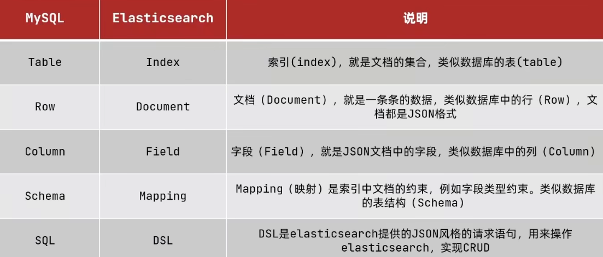

## ES (ElasticSearch)

### ES是什么

一款强大的开源搜索引擎，可以从海量数据中快速找到需要的内容

由多个组件构成，最主要的ElasticSearch组件用来存储，计算，搜索数据；Logstash，Beats组件来负责数据抓取；Kibana组件负责数据可视化;数据抓取，数据可视化都可换。

> ElasticSearch组件底层是Lucene是一个基于java的搜索引擎类库。

### 倒排索引，正向索引

- 文档：每一条 数据就是一个文档 json格式

- 词条：对文档内容分词得到的词义就是词条

- 正向索引: 基于文档id创建索引，查询词条先去找到文档，然后判断是否包含词条

- 倒排索引 ： 对文档内容分词，对词条创建索引，并记录词条所在文档的信息。查询时先根据词条查询到文档id，然后获取到文档

### ES与MySQL概念对比



### ES的安装

1. 创建网络，将Kibana容器与es容器互联

   ```shell
   docker network create es-net
   # es-net是网络名称
   ```

2.  加载es的镜像

   ```shell
   docker pull docker.io/elasticsearch:7.12.1
   # 1个g
   ```

3. 运行es

   ```shell
   docker run -d \ # 后台运行
   	--name es \  # 容器名
       -e "ES_JAVA_OPTS=-Xms512m -Xmx512m" \ # java堆内存大小，默认1个g
       -e "discovery.type=single-node" \ # 运行模式，这个是单点模式
       -v es-data:/usr/share/elasticsearch/data \ # 数据卷挂载 数据
       -v es-plugins:/usr/share/elasticsearch/plugins \ #数据券挂载 插件 
       --privileged \ 
       --network es-net \ # 加入网络
       -p 9200:9200 \ # http端口 用户访问
       -p 9300:9300 \ # es各个节点相互访问的端口
   elasticsearch:7.12.1
   ```

4. 部署Kibana

   ```shell
   docker run -d \
   --name kibana \
   -e ELASTICSEARCH_HOSTS=http://es:9200 \ # es地址，通过容器名互联
   --network=es-net \
   -p 5601:5601  \
   kibana:7.12.1 # 必须与es版本一致
   ```

   

### 修改es分词器

#### 使用IK分词器

1. 下载ik分词器

   ```
   https://github.com/medcl/elasticsearch-analysis-ik/releases/download/v7.3.0/elasticsearch-analysis-ik-7.12.1.zip
   # 会直接下载
   ```

2. 将下载的文件解压缩到上面es-plugins挂载的数据券所在的目录 /_data/ik

3. 在请求的时候指定分词器"analyer":"ik_max_word"   


有两种模式，it_smart智能切分和ik_max_word最细切分 ，后者切得多，消耗大。例如程序员前切到程序就停了。后会切成程序和程序员.


##### 修改ik分词器词汇扩展和停用

修改config目录下的IKAnalyzer.cfg.xml文件添加词典,修改后需要重启


### 索引库

#### mapping 文档约束(字段类型)

##### Type 字段数据类型（没有数组，但是可以多个）

- text : 字符串 ，可分词文本。例如
- keyword :  精确值，不可拆。比如国家名，品牌名，邮箱，qq等
- long，integer，short，byte,double,float
- boolean
- date
- object

##### index  索引

是否创建索引，默认为true，是否参与搜索

##### analyzer 分词器

type为text才能分词，默认不能分汉字。analyzer 的值为分词器种类

##### properties 字段的子字段

#### 

### DSL语法

[DSL语法](ElasticsearchDSL常用语法.md)

### RestClient

> RestClient是不同语言的客户端，本质是组装好的dsl语句。

#### JavaRestClient

##### 使用

1. 父工程引入依赖

   ```xml
   <dependency>
         <groupId>org.springframework.boot</groupId>
         <artifactId>spring-boot-starter-data-elasticsearch</artifactId>
         <version>7.12.1</version>
   </dependency>
   
   ```

   

   

##### 通过RestHighLevelClient对象的indices()方法 发起请求

```java

public static void main(String[] args) {

    
//初始客户端，通过这个客户端发请求
RestHighLevelClient client= new RestHighLevelClient(RestClient.builder(
	HttpHost.create("http:/地址:端口");//es服务
))
    
    //不同操作示例，共用初始化代码，和关闭
    
    //创建索引库
    // 1.创建request操作对象
    CreateIndexRequest request= new CreateIndexRequest("索引库名");//这个操作时DSL的请求头
    // 2.请求语句，以及格式
    request.source("DSL语句就是写好直接复制过来",XcontentType.JSON);
    // 3.发出请求 封装索引库请求都在client.indices()里，
    //RequestOptions.DEFAULT这里可以修改请求内容，一般不做修改
    client.indices().create(request,RequestOptions.DEFAULT);
    
    //新增数据
    // 1.创建request操作对象  指定id(不指定会自动生成)
    IndexRequest request= new IndexRequest("索引库名").id("id");
    // 2.json文档
    request.source("DSL语句就是写好直接复制过来",XcontentType.JSON);
    // 3.封装文档请求都在client.index()里
    client.index(request,RequestOptions.DEFAULT);
    
    //查询数据
    // 1.创建request操作对象
    GetRequest request = new GetRequest("索引库名","id");
    // 2.发请求
    GetResponse response = client.get(request,RequestOptions.DEFAULT);
    // 3.解析响应
    String json = response.getSourceAsString();
    
    //修改数据
    // 1.创建request操作对象
    UpdateRequest request = new UpdateRequest("索引库名","id");
    // 2.json文档
    request.doc(
        "a","a值",
        "b","b值");
    // 3.发送请求
    client.update(request,RequestOptions.DEFAULT);

    //删除数据
    // 1.创建request操作对象
    DeleteRequest request = new DeleteRequest("索引库名","id");
    // 2.json文档
    client.delete(request,RequestOptions.DEFAULT);
    
    
    //使用BulkRequest对象批量操作
    BulkRequest request = new BulkRequest();
    for(Users user : userList){
        request.add(new IndexRequest("索引库").id("id"))//add()添加dsl语句用，可以增删改查
        		.source(JSON.toJSONString(user),RequestOptions.DEFAULT);
            )
    }
    client.bulk(request,RequestOptions.DEFAULT);
    
    
  
    
//用完必须关了
    client.close(); 
}
```

