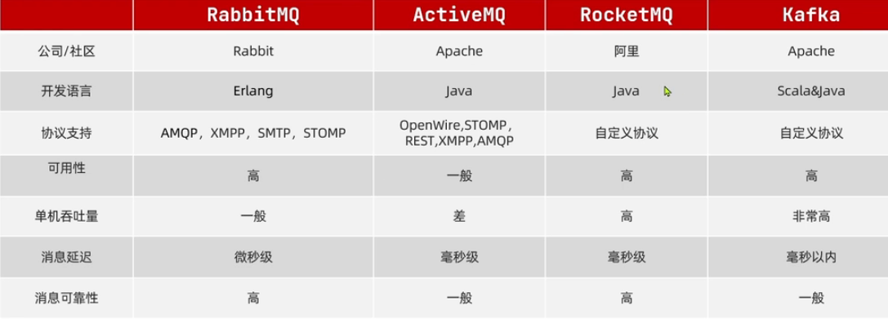
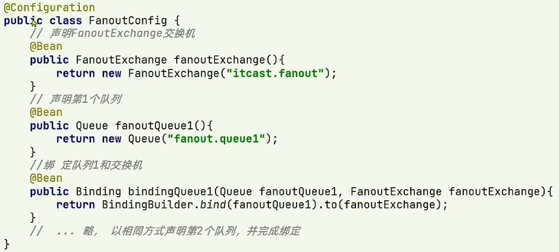

### 异步通信和同步通信的优缺点

#### 同步通信

##### 缺点

- 耦合度高，修改业务需要改代码.
- 性能和吞吐量下降，每次请求必须走完 流程
- 有额外的资源消耗，在进行到某一服务的时候，其他流程内的服务都处于等待状态
- 有级联失败问题，流程内某一服务失败，全部其他服务也失败，导致其他服务也无法访问.

##### 优点

- 时效性强，可以立即得到结果

#### 异步通信

##### 优点

- 耦合度低
- 吞吐量提升
- 故障隔离
- 流量削峰

##### 缺点

- 依赖于Broker（业务之间的通知者）的可靠性，安全性，吞吐能力。
- 架构复杂，业务没有明显的流程线，不好追踪管理

### MQ(MessageQueue)(消息队列)

用于事件驱动架构中的Broker

#### 常见的mq技术



### Excgange交换机

发布订阅模式能够将一个消息发给多个消费者，实现的方式是交换机 。

发布者将消息发送给交换机，交换机将消息发送给消费者。

常见的交换机的种类有三种

1. Fanout  广播：与交换机绑定的每个队列都会收到 
2. Direct 路由： 根据规则路由（发送者的routingKey与消费者的BindingKey对应）发送到指定的队列
3. Topic 话题：与Direct 区别routingKey必须是多个单词的列表，以.分割。消费时BindingKey可以使用通配符例如#表示0或多个单词，* 表示一个单词

### RabbitMQ

> 基于ErLang语言的开源消息通信中间件

####  使用docker安装

1. 创建数据券，持久化数据

   ```bash
   docker volume create rabbitmq-home
   ```

2. 创建并运行容器

   ```bash
   docker run \
   -e RABBITMQ_DEFAULT_USER=root \
   -e RABBITMQ_DEFAULT_PASS=592394314 \
   --name rabbitmq \
   --hostname rabbitmq1 \
   -p 15672:15672 \
   -p 5672:5672 \
   -d \
   -v rabbitmq-home:/var/lib/rabbitmq  \
   rabbitmq:3-management
   
   2,3行是rabbitmq的账号密码; 4行是容器名; 5行是在集群的名字; 6行是rabbitmq管理平台的端口;
   7行是消息订阅发布的端口; -d是后台运行； 10行用于下载指定版本的rabbitmq
   ```

   
   
   #### 常见的消息模型

##### 消息队列

包括三个角色

1. 消息发布者(publisher)：将消息发送给queue
2. 消息队列(queue)：处理接收并缓存消息
3. 订阅队列(consumer)：处理队列中的消息

#### SpringANQP

##### 什么是SpringAMQP

AMQP：用于在应用程序之间传递业务消息的开放标准（协议）

pringAMQP: 基于AMQP协议的api规范，提供模板去发送和接受消息

Spring AMQP 是 Spring Framework 对 RabbitMQ 消息中间件的集成框架。

##### 简单使用

1. 父工程引入AMQP依赖

   ```xml
   <dependency>
       <groupId>org.springframework.boot</groupId>
       <artifactId>spring-boot-starter-amqp</artifactId>
   </dependency>
   ```

2.  在publisher和consumer中添加连接配置信息

```yml
spring:
  rabbitmq:
    host: xxx.xxx.xxx.xxx # 主机
    port: xxxx #端口
    username: xxx # 用户名
    password: xxx # 密码
    virtual-host: / #rabbitmq中的虚拟主机，/是默认虚拟主机
    listener:
      simple:
        parfetch: 1 # 配置消费者每次拿取多少消息，处理完毕后获取下一次
```

3. 发送消息： publisher服务中 自动装配以使用rabbitTemplate对象的convertAndSend()方法发消息到队列,参数一是队列名，参数二是消息内容

   ```java
   //发送消息
   public void listenSimpleQueue(){
       rabbitTemplate
           .convertAndSend("队列名或交换机名","routingKey队列这个值不需要","消息");
   }  
   ```

   

4.  <span id="xiaofeixiaoxi">消费消息</span>:    在consumer服务中编写方法监听队列，并处理

   ```java
   @Component // 注册bean
   public class SpringRabbitListener {
       
       
       //指定的是交换机则需要先将队列绑定交换机
       //Fanout
       @RabbitListener(queues = "simple.queue")//接收simple.queue队列中的消息
       public void listenSimpleQueue(Object msg){
           // 处理消息
       }
       
       //Direct
        @RabbitListener(bindings = @QueueBinding(
               value = @Queue(name = "队列名"),
            	//交换机类型，默认路由
               exchange = @Exchange(name = "交换机名",type = ExchangeTypes.DIRECT),
            	//路由规则   
            	key = {"路由key","路由key2"}
       ))
       public void listenSimpleQueue(Object msg){
           // 处理消息
       }
       
       //Topic
        @RabbitListener(bindings = @QueueBinding(
               value = @Queue(name = "队列名"),
               exchange = @Exchange(name = "交换机名",type = ExchangeTypes.Topic),
            	//路由规则   
            	key = "a.b.#"
       ))
       public void listenSimpleQueue(Object msg){
           // 处理消息
       }
       
   }
   ```

#### springAMQP对FanoutExchanger的使用

1. 在消费者创建类，注入交换机和 队列以及绑定两者的bean

   

2. 消费者 [消费消息](#xiaofeixiaoxi) Fanout

3. 发送者 发送消息到交换机   rabbitTemplate.convertAndSend("交换机名","routingKey","消息");

#### springAMQP对DirectExchanger的使用

1. 消费者通过注解指定各种规则，[消费消息](#xiaofeixiaoxi) Direct
2. 发送 rabbitTemplate.convertAndSend("交换机名","路由key(routingKey)","消息");

#### springAMQP对TopicExchanger的使用

1. 消费者通过注解指定各种规则，[消费消息](#xiaofeixiaoxi) Topic     a.b.*
2. 发送 rabbitTemplate.convertAndSend("交换机名","a.b.d","消息");

#### 修改消息转换器

默认的是javaObject的转换器，修改为JSON

发送和接收需要使用相同的转换器

1.  引依赖

   ```xml
   <dependency>
       <groupId>com.fasterxml.jackson.dataformat</groupId>
       <artifactId>jackson-dataformat-xml</artifactId>
       <version>2.9.10</version>
   </dependency>
   ```

2. 注入bean 

   ```java
   @Bean
   public Jackson2JsonMessageConverter messageContext(){
       return new Jackson2JsonMessageConverter();
   }
   ```
