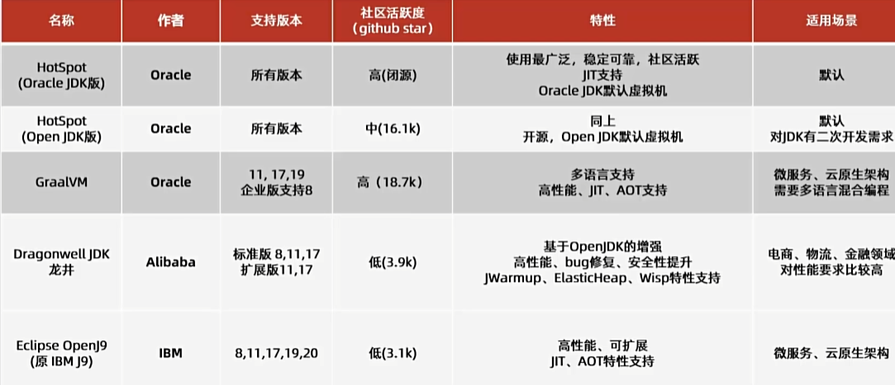

# 1.目录
- [1.目录](#1目录)
  - [什么是JVM](#什么是jvm)
  - [JVM的功能](#jvm的功能)
  - [常见的JVM](#常见的jvm)
  - [JVM的主要组成部分](#jvm的主要组成部分)
- [2.JVM-内存结构](#2jvm-内存结构)
- [3.HotSpot-虚拟机对象](#3hotspot-虚拟机对象)
- [4.HotSpot-垃圾收集器](#4hotspot-垃圾收集器)
- [5.垃圾收集策略与算法](#5垃圾收集策略与算法)
- [6.内存分配与回收策略](#6内存分配与回收策略)
- [7.JVM 性能调优](#7jvm-性能调优)
- [8.类文件](#8类文件)
  - [class字节码文件](#class字节码文件)
    - [组成](#组成)
      - [魔数](#魔数)
- [9.类加载](#9类加载)

## 什么是JVM

本质上是一个运行在计算机上海的程序，负责运行字节码文件。

java文件通过javac编译成class字节码文件，然后到jvm里运行解释成机器码交给计算机执行程序。

## JVM的功能

- 解释和运行

- 内存管理

- 即使编译（Just-In-Time简称JIT）: 多次运行的代码字节码指令会解释优化 成机器码 然后 存入内存，之后直接调用

## 常见的JVM

 > java虚拟机规范由Oracle制定 ,该规范是对虚拟机设计的要求，也就是说虚拟机可以运行其他语言生成的class文件,比如Groovy语言等
 
 

## JVM的主要组成部分

1. 类加载器
   > 加载字节码文件，分七个步骤
2. 运行时内存区
   > 不同的数据放在不同的区域，分为5个区
3. 执行引擎
   - 即使编译器
   - 解释器
   - 垃圾回收器
   - 等

# 2.JVM-内存结构

# 3.HotSpot-虚拟机对象

# 4.HotSpot-垃圾收集器

# 5.垃圾收集策略与算法

# 6.内存分配与回收策略

# 7.JVM 性能调优

# 8.类文件

## class字节码文件

> 保存了源代码编译之后的内容，以二进制的方式存储

可以通过一些工具查看class文件相关信息。比如Release(github可找到),idea插件jclasslib等

### 组成

1. 基础信息
   1. 魔数
   2. 版本号
   3. 访问标识
   4. 父类
   5. 接口
2. 常量池
   > 字符串常量，类或接口名，字段名，主要在字节码指令中使用
3. 字段
   > 声明的字段信息
4. 方法
   > 被转换成字节码指令的代码
5. 属性
   > 类文件的属性，比如源码文件，内部类的列表等

#### 魔数

Class 文件的头 4 个字节称为魔数，用来表示这个 Class 文件的类型。

Class 文件的魔数是用 16 进制表示的“CAFE BABE”，是不是很具有浪漫色彩？

> 魔数相当于文件后缀名，只不过后缀名容易被修改，不安全，因此在 Class 文件中标识文件类型比较合适。

# 9.类加载
