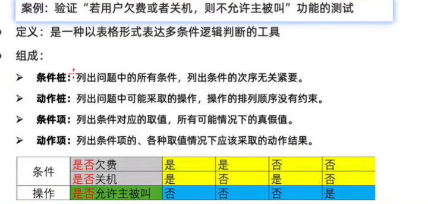
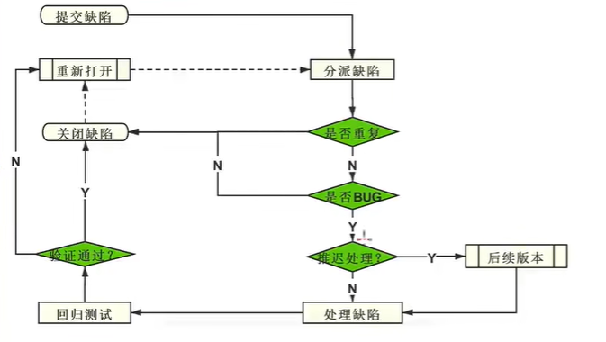

### 测试分类
- 按开发阶段
  - 单元测试(白盒) ：针对程序源代码进行测试
  - 集成测试(联调) ：接口测试，对模块之间访问地址进行测试
  - 系统测试(黑盒) ：对整个系统进行测试，包含功能，兼容，文档等测试
  - 验收测试 ：主要分内侧，公测，使用不同人群发掘项目缺陷
- 按是否查看源代码
  - 黑盒测试:源代码不可见，ui功能可见,不关心盒子内部结构，只关心输入输出
  - 白盒测试：又称结构测试，透明盒测试，打开盒子，研究源代码和程序结果
  - 灰盒测试：功能加接口测试，多用于集成测试
- 

### 质量模型
> 模型: 衡量一个软件的纬度
一般从八个纬度测试
- 功能性
- 性能
- 兼容性
- 易用性
- 可靠性
- 安全
- 可维护性
- 可移植性

### 测试流程
1. 需求评审
2. 计划编写：测什么，谁来侧，怎么测
3. 用例设计
4. 用例执行
5. 缺陷管理：对缺陷进行管理
6. 测试报告

### 测试用例
作用：防止漏测；实时测试的标准

正向：按照正常输入期望的数据
逆向：异常输入
兼容：例如多个浏览器，设备等
#### 格式(八大要素)

- 用例编号
- 用例标题: 预期（结果）eg: 登录(账号为空)
- 项目/模块
- 优先级:根据使用频率分为P0~4越频繁越小
- 前置条件
- 测试步骤
- 测试数据
- 预期结果

### 测试点设计
场景
  - 对穷举场景：多种可能抽取某几种可能 
  - 限定边界规则：eg：限定多少位
  - 多条件依赖关系：若1或2则3或4
  - 项目业务
解决方法
  - 等价类划分：根据某种共同特征分为有效等价类和无效等价类，有效等价只取一个，无效可以取多个，然后设计测试用例；一般解决穷举，例如输入框，下拉列表，单选复选框
  - 边界值分析法：选取正好大于，正好小于(离点：离边界最近的点)，等于(上点：边界点)，(内点：范围内的点)三个类型的点
  - 判定表：,多条件和多输出，一般用于四个条件以下，再多用正交法
  - 场景法：使用流程图来表达程序或业务的走向
  - 错误推荐法：根据经验推测可能出现的问题，一般在时间紧任务量大时才用，之后需要重新测试

### 缺陷
- 缺陷判定的标准定义
  >软件使用的过程中存在的任何问题都是缺陷
  · 未实现需求说明书中明确的功能-少功能
  · 功能错误
  · 多功能：超出说明书指明的范围
  · 隐形功能错误：未实现需求说明书中未明确但应该实现的功能
  · 不宜使用：软件难以理解，不宜使用，运行缓慢，用户体验不好

缺陷提交要素
    1. 缺陷编号
    2. 严重程度
        - 严重：主功能
        - 一般：次要功能
        - 微小：易用性，界面
        - 建议：建议性
    3. 缺陷优先级
        - 0: 24小时内解决
        - 1：发布前必须修复
        - 2：可以下个版本解决
    4. bug类型
        - 代码错误，兼容性问题，设计缺陷等
    5. 缺陷状态
        - new ：新建
        - open：打开
        - closed: 关闭
        - 延期

工作流程

